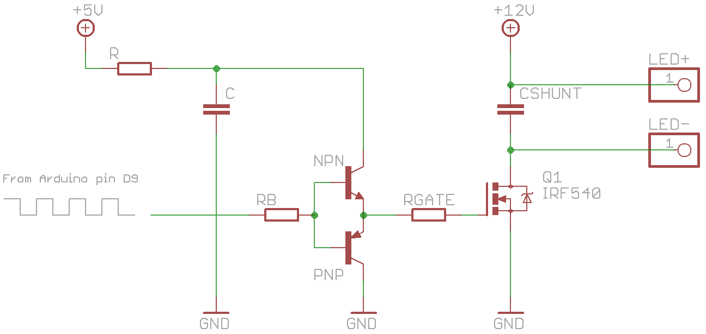

# LED pwm fader with arduino uno 💡

### Problem: No aftermarket lights for my car

### Solution:

This project got it's start when I decided I wanted to retrofit F-Series angel eyes to my E46 bmw.
There were no ready to go solution on market so started to build my own. It never actually got into
use since that car I was building this on, got sold.

It was a nice first touch to embedded systems and actually making something happen with my code.
Problems I encountered were not well documentated and it took waaaay too much time to figure them out,
but it was just that much more satisfying when it finally did work.

### Linear or logarithmic?
Biggest challenge of this project was that human eye does not see brightness (nits) linearly... 

It should be logarithmic💡

Yeah, well I did not know this back then and it took days of debugging to figure out that even tho my log
seemed to be working nicely (it was basic while; loop) my brightness was not matching that.

After few days I found out another implementation of led fading in and out that was using logarithmic approach. It worked instantly. Now my log was weird since it was not going smoothly from 0 to 100 brightness but the gradient were smooth. Damn human eyes so weird👀

### Arduino limitations
First I tried to solve this with hardware only, capacitors and power drain circuits but it was a mess, I had no experience
with circuits or electrical engineering and I just could not make it work.

After a while, I switched to arduino but with that was a problem that my arduino uno's default pwm signal was coming from 8bit timing chip and it was just not enough resoluiton, it was going in big increments that was visually unpleasing, it was not a gradient...
As it turns out, there is 16bit timer lurking in arduino, it is just not using it for pwm as default, after finding
some super weird code to take use of it, My gradient started working nicely.

## Implementation:

credit: http://joost.damad.be/2012/09/dimming-12v-led-strip-with-mosfet-and.html
